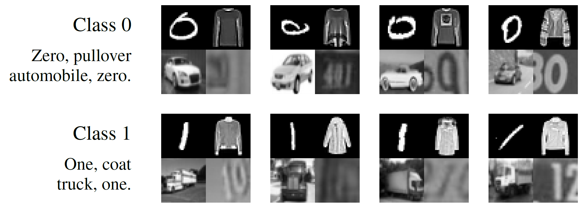

# Collages dataset
This repository contains the dataset described in the following paper:
[Combatting the Simplicity Bias with Diversity for Improved Out-of-Distribution Generalization](https://arxiv.org/abs/????.?????), Teney et al.

<p align="center">

</p>

The task is a binary classification task. Each image is a tiling of four blocks corresponding to four well-known datasets: MNIST, CIFAR-10, Fashion-MNIST, and SVHN.
One of two classes of the original datasets appear in each block.
In the training data, the class in every block is predictive of the collage label.
We provide four test sets, in which the class of only one of the four blocks is correlated with the label.

The dataset can be used to measure the propensity of a learning algorithm to focus on only parts of the images, resilience to (potentially) spurious patterns, etc.
It can, for example, replace, the popular Colored-MNIST toy dataset.

Because of the [simplicity bias](https://arxiv.org/abs/2006.07710), training a simple neural network on this dataset produces a model that **systematically focus on the MNIST digit while ignoring other parts of the collages** because those parts are more complex to classify.

## Downloads
We provide **4-block** and **2-block** (MNIST and CIFAR only) versions of the dataset.
We provide them in **ordered** and **shuffled** version (blocks appearing in random order). The shuffled version can be used to demonstrate that a given method does not rely on a known or constant image structure.
We generated the collages in 1/4th resolution compared to the original datasets (i.e. collages of 16x16 pixels) which enables very fast experimentation.
Other versions can be generated with the provided script.

- [2-Block collages, ordered, 1/4 image size](collages-2blocks-randomOrder0-downsampling2.zip)
- [2-Block collages, shuffled, 1/4 image size](collages-2blocks-randomOrder1-downsampling2.zip)
- [4-Block collages, ordered, 1/4 image size](collages-4blocks-randomOrder0-downsampling2.zip)  (as used in [our paper](https://arxiv.org/abs/????.?????))
- [4-Block collages, shuffled, 1/4 image size](collages-4blocks-randomOrder1-downsampling2.zip)

## Generation of the dataset
The (Matlab script to generate the dataset)[generateCollages.m] is provided in this repository. The script proceeds as follows.
We use first load images from MNIST, Fashion-MNIST, CIFAR-10, and SVHN.
The images are converted to grayscale. The images from MNIST and Fashion-MNIST are padded to 32x32 pixels.
We pre-select two classes from each dataset to be respectively associated with the collages 0 and 1 label.
We follow [Shah et al.](https://arxiv.org/abs/2006.07710) and choose 0/1 for MNIST, automobile/truck for CIFAR-10, and additionally choose 0/1 for SVHN and pullover/coat for Fashion-MNIST.
We generate a training set of 51,200 collages (50*1024) and several test sets of 10,240 collages (10*1024).
Each collage is formed by tiling four blocks, each containing an image chosen at random from the corresponding source dataset.
The images in our training/evaluation sets come respectively from the original training/test sets of the source datasets.

In the training set, the class in each block is perfectly correlated with collage label.
In each of the four test sets, the class in only one block is correlated with the collage label. The other blocks are randomized to either of its two possible classes.
We also generate four training sets in this manner, to be used solely to obtain upper bounds on the highest accuracy achievable on each block with a given architecture.

## Citation
Please cite the dataset as follows:
```
@inproceedings{teney2021combatting,
  title={Combatting the Simplicity Bias with Diversity for Improved Out-of-Distribution Generalization},
  author={Teney, Damien and Abbasnejad, Ehsan  and Lucey, Simon and van den Hengel, Anton},
  year={2021}
}
```
Also check out the paper by Shah et al. that first proposed 2-block collages of MNIST and CIFAR-10: [The Pitfalls of Simplicity Bias in Neural Networks](https://arxiv.org/abs/2006.07710).

Please report any issue to [contact@damienteney.info](mailto:contact@damienteney.info).
