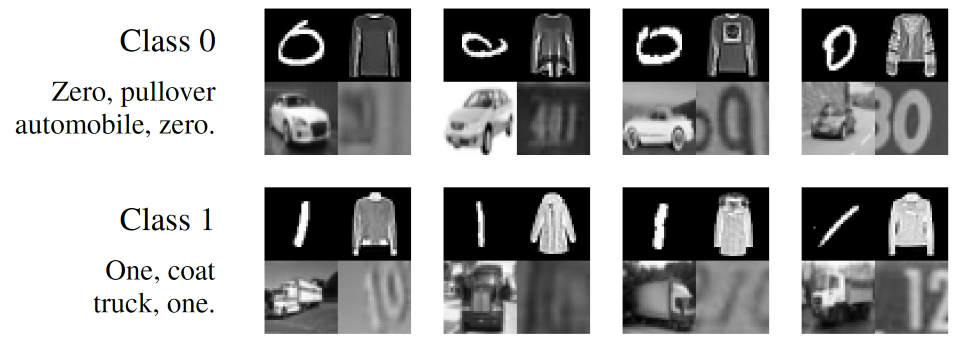
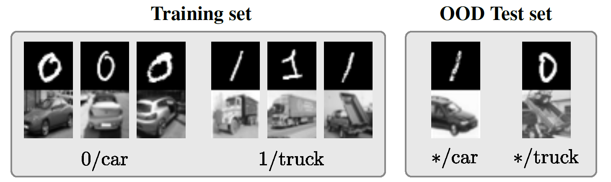

# Collages dataset
This repository contains the dataset described in the paper
[Combatting the Simplicity Bias with Diversity for Improved Out-of-Distribution Generalization](https://arxiv.org/abs/????.?????) by Teney et al.

The task is a binary classification task. Each image is a tiling of four blocks. Each block contains one of two classes from well-known datasets: MNIST, CIFAR-10, Fashion-MNIST, and SVHN.
- In the **training data** the class in every block is predictive of the collage label.
- In each of **four test sets** the class of only one of the four blocks is correlated with the label.

<p align="center">

*Sample training images*
</p>

Because of the simplicity bias (see [Shah et al.](https://arxiv.org/abs/2006.07710)) **a neural network naively trained on this dataset systematically focuses on the MNIST digit while ignoring other parts** that are more difficult to classify. Therefore the accuracy on three of the four test sets does not raise above chance (50%).

The dataset can be used to measure the propensity of a learning algorithm to focus only on parts of images, its resilience to (potentially) spurious patterns, etc.
It can replace the popular Colored-MNIST toy data for some use cases.

<p align="center">

*Example use case: OOD testing with 2-block collages.*
</p>

## Downloads
We provide **4-block** and **2-block** versions (MNIST and CIFAR only) of the dataset.
We provide **ordered** and **shuffled** version (blocks appearing in random order). The shuffled version can be used to demonstrate that a given method does not rely on a known or constant image structure.
We generated the collages in 1/4th the resolution of the original datasets (i.e. collages of 16x16 pixels) to enable very fast experimentation.
Other versions can be generated with the script provided.

- [2-Block collages, ordered, 1/4 image size](data/collages-2blocks-randomOrder0-downsampling2.zip) (~73MB)
- [2-Block collages, shuffled, 1/4 image size](data/collages-2blocks-randomOrder1-downsampling2.zip) (~73MB)
- [4-Block collages, ordered, 1/4 image size](data/collages-4blocks-randomOrder0-downsampling2.zip) (~161MB) (as used in [our paper](https://arxiv.org/abs/????.?????))
- [4-Block collages, shuffled, 1/4 image size](data/collages-4blocks-randomOrder1-downsampling2.zip) (~161MB)

## Generation of the dataset
We provide a [Matlab script to generate the dataset](code/generateCollages.m) in different versions than those provided. The script proceeds as follows.
We use first load images from MNIST, Fashion-MNIST, CIFAR-10, and SVHN.
The images are converted to grayscale. The images from MNIST and Fashion-MNIST are padded to 32x32 pixels.
We pre-select two classes from each dataset to be respectively associated with the labels (of collages) 0 and 1.
We follow [Shah et al.](https://arxiv.org/abs/2006.07710) and choose 0/1 for MNIST, automobile/truck for CIFAR-10. We then choose 0/1 for SVHN and pullover/coat for Fashion-MNIST.
We generate a training set of 51,200 collages (=50\*1024) and several test sets of 10,240 collages (=10\*1024).
Each collage is formed by tiling four blocks, each containing an image chosen at random from the corresponding source dataset.
The images in the training/evaluation sets come from the original training/test sets of the source datasets.

In the training set, the class in each block is perfectly correlated with collage label.
In each of the four test sets, the class in only one block is correlated with the collage label. Other blocks are randomized to either of the two possible classes.
We also generate four training sets in this manner to be used solely to obtain upper bounds on the highest accuracy achievable on each block with a given model/architecture.

## Citation
Please cite the dataset as follows:
```
@inproceedings{teney2021combatting,
  title={Combatting the Simplicity Bias with Diversity for Improved Out-of-Distribution Generalization},
  author={Teney, Damien and Abbasnejad, Ehsan  and Lucey, Simon and van den Hengel, Anton},
  year={2021}
}
```
Also check out the paper by Shah et al. that first proposed 2-block collages of MNIST and CIFAR-10:
[The Pitfalls of Simplicity Bias in Neural Networks](https://arxiv.org/abs/2006.07710).

Please report any issue to [contact@damienteney.info](mailto:contact@damienteney.info).
